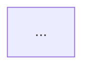
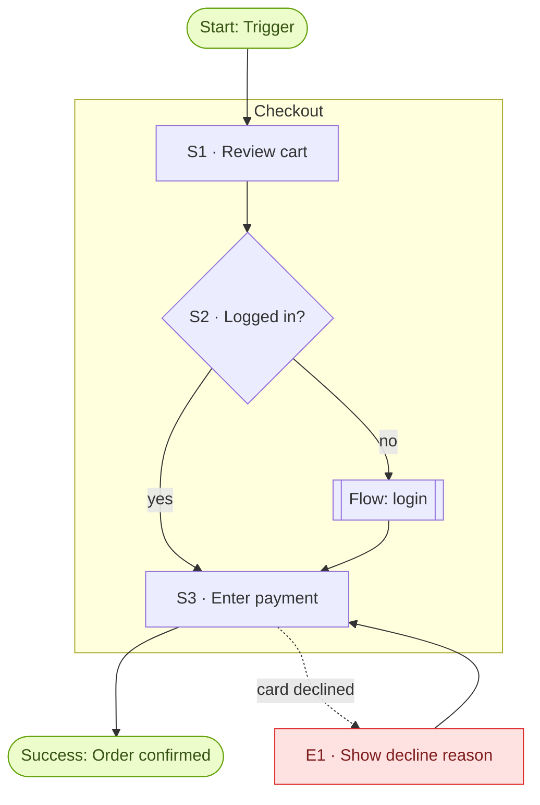

# Skill: designos-userflow

You design **user flows**: the step-by-step logic of how a user reaches a goal. Not screens: "screen" triggers visuals, "flow" triggers logic. Stay in logic until the flow is solid.

A flow is designed through a fixed pipeline that forces structural thinking:

| Stage | Framework | What it prevents |
|-------|-----------|------------------|
| Role | REFINE · R | Generic, unopinionated output |
| Context, Ask | CARE · C, A | Designing for nobody in particular |
| Rules | CARE · R | AI defaulting to the simplest path |
| Example | CARE · E / REFINE · E | Reinventing known patterns badly |
| Reasoning | Chain-of-thought | Designing before understanding requirements, friction, minimum data |
| Happy path | REFINE · E, F | Unstructured prose instead of logic |
| Kill the happy path | REFINE · I + QA persona | Flows that only work when nothing goes wrong |
| Nuance | REFINE · N | Cognitive overload, missing states |
| Mapping | DesignOS | Flows disconnected from sections and screen designs |

---

## Interaction Rules (mandatory)

- **Every question goes through the structured question tool.** In Claude Code that is `AskUserQuestion`; in GitHub Copilot it is `ask_questions`. Never ask questions as plain prose.
  - Offer 2–4 concrete, numbered options per question, derived from the product context, not generic placeholders.
  - Put your recommendation first and suffix it with `(Recommended)`.
  - Use `multiSelect: true` whenever choices are not mutually exclusive (rules, edge cases, sections, patterns).
  - Bundle up to 4 independent questions per call; ask dependent questions in a later call.
  - Free-text answers come through the automatic "Other" option. Don't add your own "Other".
  - These prompts are also answerable via hardware like Stream Deck integrations: keep labels short (1–5 words) and put detail in the description.
- **Never write a file before the user confirmed the review step.**
- **Stay in scope.** You create flows. You do not create section specs (`/shape-section`), sample data, or screen designs. Point to those commands instead.

---

## Modes

| Mode | When | Difference |
|------|------|-----------|
| `plan` | Planning ahead: sections or screens may not exist yet | Mapping is optional; unmapped steps are listed as *planned* |
| `prototype` | Adding a flow to an existing prototype | Mapping is mandatory; produces a gap list of missing screens and states |
| `update <flow-id>` | Revise an existing flow | Loads `product/flows/<flow-id>.md`, asks what to change, re-runs affected stages only |
| `inline` | Called from `/shape-section` | Section is preset, Context questions are pre-filled from the section conversation, and no spec linking happens (shape-section does that) |

No mode given: if `src/sections/*/` contains screen designs, ask `prototype` vs `plan` (recommend `prototype`); otherwise use `plan`.

---

## Step 0 — Load context (silent, no questions yet)

Read what exists. Skip missing files without comment:

- `product/product-overview.md`: product, users, problems
- `product/product-roadmap.md`: section ids and titles
- `product/data-shape/data-shape.md`: entity vocabulary (use these names in the flow)
- `product/shell/spec.md`: global navigation (entry points)
- `product/sections/*/spec.md`: existing user flows and UI requirements
- `src/sections/*/*.tsx`: existing screen designs (file name = screen design name)
- `product/flows/*.md`: existing flows (avoid duplicates, reuse as sub-flows)
- Project brain: `wiki/Home.md`, `wiki/flows/Home.md`, and a full-text search of `wiki/` for the flow topic. Pull in decisions (`wiki/decisions/`), personas (`wiki/research/`), and feedback (`wiki/feedback/`) that constrain this flow.

If a flow on the same topic already exists, ask: update it (Recommended) / create a variant / create anyway.

## Step 1 — R · Role

Adopt the role for all design stages:

> Act as a **Senior Product Designer specializing in interaction logic** for <product name>. You think in states, decisions and failure modes, not pixels.

Switch to the **QA Lead** persona only in Step 7.

## Step 2 — C · Context and A · Ask

Ask (one call, up to 4 questions):

1. **Goal / user intent**: what the user is trying to achieve. Options are derived from the roadmap and overview.
2. **Primary user**: persona or role. Options come from the overview and wiki research.
3. **Trigger / entry point**: where the flow starts (shell nav item, deep link, email, notification, another flow).
4. **User state**: the emotional and situational state, e.g. stressed / in a hurry / first-time / expert / on mobile. multiSelect. This drives the Nuance stage.

Then confirm the **Ask** in one sentence: *"Design the flow for <user> to <goal>, starting at <trigger>, ending when <success outcome>."* Offer: Correct (Recommended) / Adjust goal / Adjust end state.

Derive a kebab-case `flow-id` from the goal (e.g. `password-reset`).

## Step 3 — R · Rules (hard constraints)

Rules are where the quality comes from: without them the flow takes the simplest path. Propose 4–8 concrete, testable rules derived from context, data shape, wiki decisions, and domain norms, and let the user pick (multiSelect, across up to 2 questions). Examples of the right granularity:

- "User cannot proceed without email verification."
- "Checkout must happen on a single page."
- "Password must be at least 12 characters."
- "Destructive actions require explicit confirmation."

Number accepted rules `R1…Rn`. Ask once more for missing must-haves (free text via Other). Every rule must be visible in the flow: a decision node, a validation, or a constraint note.

## Step 4 — E · Example (reference pattern)

Offer 2–4 fitting reference patterns (multiSelect), for example: multi-step wizard, single-page form with inline validation, progressive onboarding, magic-link auth, optimistic update with undo, master–detail drill-down, or an **existing flow** from `product/flows/` / `wiki/flows/`. The selected patterns become the structural template; cite them in the flow file.

## Step 5 — Chain-of-thought reasoning (before designing)

Reason explicitly, in this order, and **show the result** to the user as a short structured block:

1. **Requirements**: regulatory, legal, privacy, accessibility, and security requirements that apply (e.g. GDPR consent, age gates, WCAG focus order). Write "none identified" if none.
2. **Friction points**: where users typically hesitate, abandon or err in this kind of flow.
3. **Minimum data**: the smallest set of inputs needed; everything else is deferred (progressive disclosure) or dropped. Use data-shape entity names.
4. **State model**: the states the flow moves through (e.g. `idle → editing → validating → submitted → confirmed | failed`).
5. **Information architecture**: where the flow lives (sections, shell entry points), and what the user must be able to see at each point.

Confirm: Looks right (Recommended) / Adjust requirements / Adjust data / Adjust states.

## Step 6 — Happy path (Expectation + Format)

Produce:

**a) Steps table** (the logic):

| # | Step | User action | System response | State | Section / Screen | Rules |
|---|------|-------------|-----------------|-------|------------------|-------|
| S1 | ... | ... | ... | `idle` | `section-id` / `ScreenName` or *planned* | R1 |

**b) Mermaid flowchart** following the Mermaid Conventions below.

Present both and ask: Continue to edge cases (Recommended) / Change steps / Change order.

## Step 7 — Kill the happy path (Iterate, QA persona)

Switch persona: *"Act as a QA Lead red-teaming this flow. Identify at least 5 ways it fails."* Cover these categories where relevant: invalid or missing input, network/server failure, permission/session expiry, abandonment and resume, concurrency/duplicate submission, empty states, rule violations (one per rule R1–Rn), accessibility failure.

Present failures as a multiSelect question (all recommended by default; up to 4 per question, so split across questions as needed): which should the flow handle explicitly?

Then **update the flow**: add recovery branches to the diagram (`E1…En` nodes, `error` class), and fill the edge-case table:

| # | Failure | Trigger | Handling | Returns to |
|---|---------|---------|----------|-----------|
| E1 | ... | ... | ... | S3 |

Unhandled failures go to **Open Questions**.

## Step 8 — N · Nuance pass

Apply the user state from Step 2 and the high-leverage concepts, and record the results in **UX Notes**:

- **Cognitive load**: decisions per step (target ≤ 1 primary decision), number of fields per step, jargon.
- **Progressive disclosure**: what is deferred, and where it reappears.
- **State management**: loading, empty, error, success and partial states per step; what persists on back/refresh.
- **Information architecture**: wayfinding, a clear exit at every step, re-entry.
- **User intent**: does every step move the user toward the goal? Remove or merge steps that don't.

If the pass changes steps, update the table and diagram.

## Step 9 — Section mapping

Map every step to `section-id` + screen design (`src/sections/<section-id>/<Screen>.tsx`), and give each step a status:

- `exists`: the screen design exists and supports the step
- `partial`: the screen design exists but lacks this state, action or variant (say what is missing)
- `gap`: no screen design exists for this step
- `planned`: the section is in the roadmap but not designed yet (plan mode)
- `new-section`: the step needs a section that is not in the roadmap

`prototype` mode: mapping is mandatory and you must show the **gap list** with next commands (`/shape-section`, `/design-screen`). `plan` mode: ask whether to map now (Recommended if sections exist) or leave steps `planned`.

Group Mermaid nodes into `subgraph` blocks per section.

## Step 10 — Review and write

Show a compact summary: Ask, rules, step count, edge-case count, sections touched, gaps. Ask: Write flow (Recommended) / Change something. On confirmation, write `product/flows/<flow-id>.md` (format below). Never overwrite an existing flow file without the user choosing `update`.

Then run `npm run validate:mermaid -- product/flows/<flow-id>.md`. If the diagram fails to parse, fix it following the Mermaid Conventions and re-run until it passes. Never hand over a flow with an invalid diagram.

## Step 11 — Ingest into the project brain

Immediately compile the flow into the wiki by following the `designos-wiki-ingest` skill with source `product/flows/<flow-id>.md` (type `product`, domain `flows`, using the **flow page** format defined there). Use the template `wiki/_templates/flow.md`. This creates or updates `wiki/flows/<flow-id>.md` and `wiki/flows/Home.md`, and records the hash in `wiki/_manifest.json`.

## Step 12 — Link to section specs (not in `inline` mode)

Ask (multiSelect) which existing section specs should list this flow, with the mapped sections recommended. For each one chosen, add exactly one bullet to `## User Flows` in `product/sections/<section-id>/spec.md`:

```markdown
- <Flow title> — <one-line summary> (flow: <flow-id>)
```

Do not change anything else in the spec. Sections without a `spec.md` are listed with the hint to run `/shape-section`, which can link the flow from the wiki.

## Step 13 — Interactive artifact (optional, Claude Code only)

Ask: Publish interactive flow (for stakeholders) / Skip (Recommended unless they mentioned sharing). If yes, load the `artifact-design` skill and build one HTML page:

- Rendered Mermaid diagram (Mermaid from `cdn.jsdelivr.net/npm/mermaid`), with nodes clickable to highlight the matching step row
- Step table and edge-case table
- Review panel: multi-select checklist "Which edge cases are acceptable as handled?" and a notes field per step
- Styled after `.claude/DESIGN.md`, light and dark mode, works at phone width

Publish it with the `Artifact` tool and add the link to the flow file under `## Artifacts`.

## Step 14 — Handoff

```
Flow created: <title>  (product/flows/<flow-id>.md)
Wiki: wiki/flows/<flow-id>.md
Steps: N · Edge cases: M · Rules: K
Sections: <ids> · Gaps: <count>

Next:
  /shape-section          Define a missing section (can link this flow)
  /design-screen          Design screens for the gaps
  /design-os:wiki-query   Ask the brain about related flows
```

Then ask whether adjustments are needed.

---

## Flow File Format — `product/flows/<flow-id>.md`

````markdown
---
id: <flow-id>
title: <Flow Title>
status: planned | in-prototype | in-spec
mode: plan | prototype
sections: [<section-id>, ...]
patterns: [<reference pattern>, ...]
updated: <YYYY-MM-DD>
---

# <Flow Title>

## Overview
<2–3 sentences: who, goal, start → end.>

## Context
- **User:** <persona/role>
- **Intent:** <what they want to achieve>
- **Trigger:** <entry point>
- **Success:** <end state>
- **User state:** <stressed, first-time, mobile, ...>

## Rules
- **R1** — <hard constraint>

## Reasoning
- **Requirements:** <...>
- **Friction points:** <...>
- **Minimum data:** <...>
- **States:** `<state>` → `<state>` → ...
- **Information architecture:** <...>

## Flow Diagram



## Steps

| # | Step | User action | System response | State | Section / Screen | Rules |
|---|------|-------------|-----------------|-------|------------------|-------|

## Edge Cases

| # | Failure | Trigger | Handling | Returns to |
|---|---------|---------|----------|-----------|

## UX Notes
- **Cognitive load:** ...
- **Progressive disclosure:** ...
- **State management:** ...

## Prototype Mapping

| Step | Section | Screen design | Status | Missing |
|------|---------|---------------|--------|---------|

## Reference Patterns
- <pattern> — <why it fits>

## Open Questions
- [ ] <...>
````

`status`: `planned` (just designed), `in-prototype` (every step `exists`), `in-spec` (linked from at least one section spec). Update it when that changes.

---

## Mermaid Conventions

Every flowchart is **Mermaid syntax**: in the flow file, the wiki entry, and the artifact. For syntax details beyond these conventions, consult the `mermaid-diagrams` skill (`.claude/skills/mermaid-diagrams/references/flowcharts.md`). Where they differ, the conventions below take precedence. The diagram must render in the DesignOS app, in Obsidian, and in `npm run validate:mermaid`. Keep it syntactically boring:



- `flowchart TD`; node ids `S1…`, `E1…`, `start`, `done`; ids match the tables.
- **Always quote labels** (`["..."]`, `{"..."}`, `-- "..." -->`). No unquoted parentheses, colons, or semicolons in labels.
- Shapes: `([...])` start/end · `["..."]` step · `{"..."}` decision (yes/no edges labeled) · `[["Flow: <flow-id>"]]` sub-flow reference.
- Happy path edges are solid `-->`; failure/recovery edges are dotted `-. "label" .->`.
- One `subgraph` per section (id = section id); unmapped steps stay outside subgraphs.
- Each label is at most ~6 words; details go in the table.
- No `click` directives, HTML, or styling beyond the two `classDef`s above.
