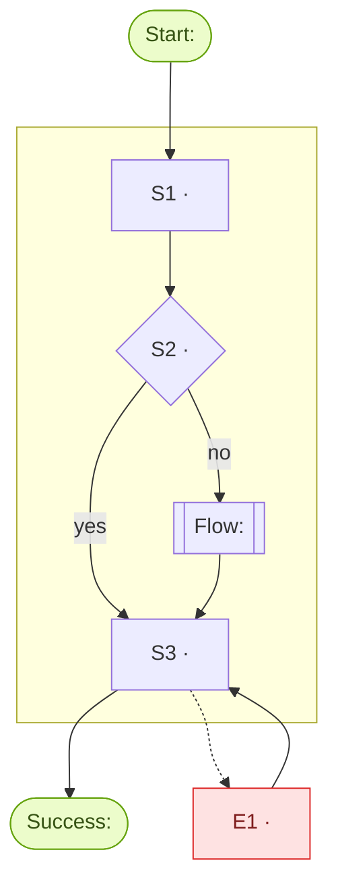

# {{title}}

## Summary
<Overview from the flow file.>

## Diagram

## Description
<Narrative walk-through of the happy path in 1–3 short paragraphs: trigger, key decisions, end state. Reference step ids (S1…). The only synthesized section — mark interpretation ^[inferred].>

## Context
- **User:** [[personas/<persona-id>]] or <role, when no persona exists>
- **Intent:** <goal>
- **Trigger:** <entry point>
- **Success:** <end state>
- **User state:** <stressed, first-time, mobile, ...>

## Rules
- **R1** — <hard constraint>

## Steps

| # | Step | User action | System response | State | Section / Screen | Rules |
|---|------|-------------|-----------------|-------|------------------|-------|
| S1 | <step> | <action> | <response> | `<state>` | `<section-id>` / `<Screen>` | R1 |

## Edge Cases

| # | Failure | Trigger | Handling | Returns to |
|---|---------|---------|----------|-----------|
| E1 | <failure> | <trigger> | <handling> | S3 |

## UX Notes
- **Cognitive load:** <...>
- **Progressive disclosure:** <...>
- **State management:** <...>

## Prototype Mapping

| Step | Section | Screen design | Status | Missing |
|------|---------|---------------|--------|---------|
| S1 | `<section-id>` | `<Screen>` | exists | — |

<One-line gap summary.>

## Open Questions
- [ ] <...>

## Related
- [[flows/<other-flow-id>]] — <sub-flow or related flow>
- [[personas/<persona-id>]] — <persona this flow is designed for>
- [[decisions/<page>]] — <decision that constrained this flow>
- `product/sections/<section-id>/spec.md` — <section this flow touches>
- `product/flows/<flow-id>.md` — source
