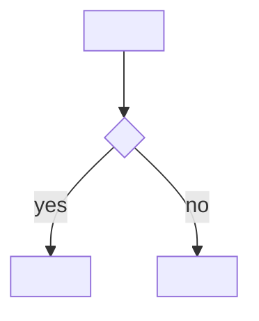

# {{title}}

## Summary
<What this is and why it matters for the product.>

## Context
<Where it came from, what problem or question it answers.>

## Key Decisions

### <Decision>
**Chose:** <X>
**Over:** <Y>
**Because:** <reason>
**Trade-off:** <what was given up>

## Details
<Distilled, reorganized knowledge — not copied source text. Rename this section to fit the content (Entities, Tokens, Findings, ...).>

## Diagram
<OPTIONAL — only when the source describes a process, structure or relationship. Always Mermaid, never ASCII art or images. Pick the type: flowchart (process, navigation), erDiagram (entities), stateDiagram-v2 (lifecycle), sequenceDiagram (interaction). Mark it ^[inferred] if it is not drawn in the source. Delete this section otherwise.>

## Open Questions
- [ ] <unresolved, deferred>

## Related
- [[<domain>/<page>]] — <what it covers>
- `product/<path>` — <artifact it reflects>
