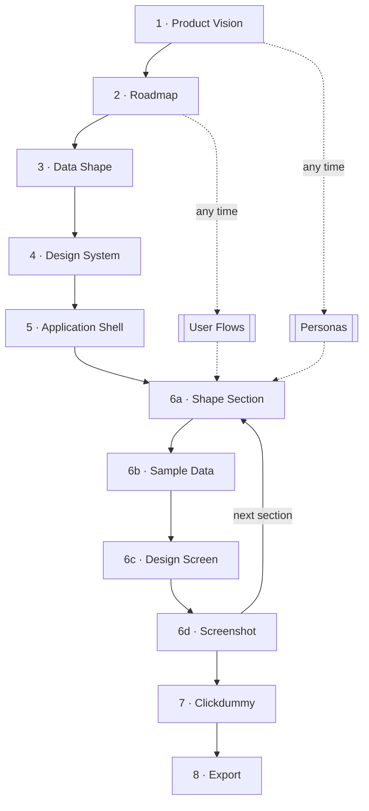

# The Planning Flow

## Summary
Design OS walks you through a fixed sequence. Each step builds on the previous ones, so finish a step before starting the next. Personas and user flows can be added at any time after the overview or roadmap exist.

## Diagram

## Steps

| # | Step | Claude Code | Copilot | Output |
|---|------|-------------|---------|--------|
| 1 | Product vision | `/product-vision` | `@00-product-vision` | `product/product-overview.md` |
| 2 | Roadmap | `/product-roadmap` | `@01-product-roadmap` | `product/product-roadmap.md` |
| 3 | Data shape | `/data-shape` | `@02-data-shape` | `product/data-shape/data-shape.md` |
| 4 | Design system | `/design-tokens` | `@03-design-system` | `product/design-system/design-system.json`, `.md` |
| 5 | Application shell | `/design-shell` | `@04-design-shell` | `product/shell/spec.md`, `src/shell/components/` |
| – | Personas | `/design-os:persona` | `@persona` | `product/personas/<id>.md` |
| – | User flows | `/design-os:userflow` | `@userflow` | `product/flows/<id>.md` |
| 6a | Shape section | `/shape-section` | `@05-shape-section` | `product/sections/<id>/spec.md` |
| 6b | Sample data | `/sample-data` | `@06-sample-data` | `data.json`, `types.ts` |
| 6c | Design screen | `/design-screen` | `@07-design-screen` | `src/sections/<id>/` |
| 6d | Screenshot | `/screenshot-design` | `@08-screenshot-design` | `product/sections/<id>/*.png` |
| 7 | Clickdummy | `/clickdummy` | `@09-clickdummy` | `/clickdummy/preview` |
| 8 | Export | `/export-product` | `@10-export-product` | `product-plan/` |

## What each step does

1. **Product vision**: name, description, problems and solutions, key features. If personas exist, they answer "who is it for".
2. **Roadmap**: the sections (feature areas) of the product. Section ids are used everywhere afterwards.
3. **Data shape**: the core entities and how they relate. Their names become the shared vocabulary.
4. **Design system**: Tailwind colors, Google Fonts, and optionally brand personality, voice and UI style. Put logos or style guides into `product/design-system/resources/` to have them analyzed.
5. **Application shell**: navigation, user menu and layout that wrap every section.
6. **Per section**, repeat:
   - **Shape section**: overview, user flows (simple bullets, linked flows, or new flows created inline), personas, UI requirements, shell on/off.
   - **Sample data**: realistic `data.json` and TypeScript types.
   - **Design screen**: props-based React components, responsive, light and dark mode.
   - **Screenshot**: images for the export.
7. **Clickdummy**: all sections inside the shell with working navigation, for stakeholder demos.
8. **Export**: components, types, design system, personas, flows, test specs and ready-to-paste prompts for a coding agent.

## After every step
- Run `/design-os:wiki-ingest --product` so the project brain picks up the new artifact.
- Run `/design-os:wiki-capture` if the session produced decisions that are not in the artifact.

## Related
- [[how-to/personas]] — personas in detail
- [[how-to/user-flows]] — user flows in detail
- [[how-to/project-brain]] — the wiki
